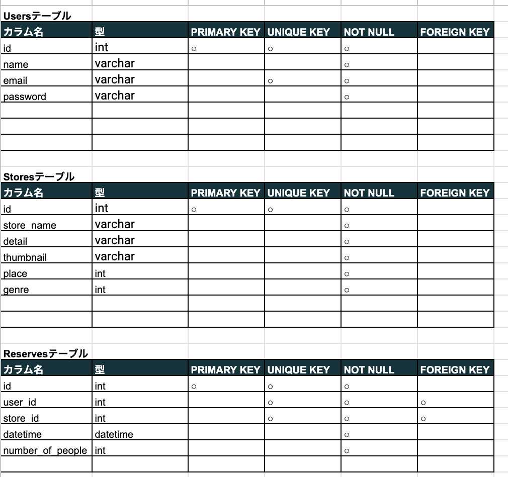
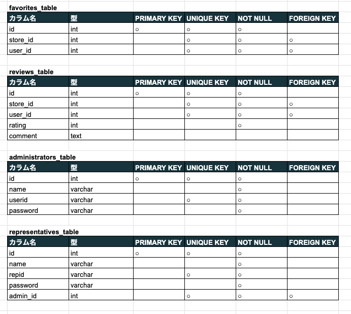
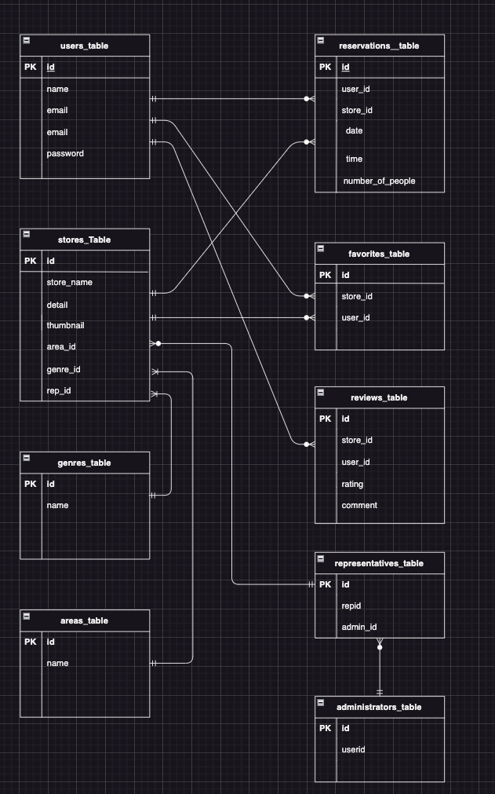

# Rese(リーズ)　　
ある企業のグループ会社の飲食店予約サービス　　
会員登録後、飲食店一覧の閲覧、お気に入り追加/削除、飲食店の予約/削除をすることができる。　　

## 作成した目的　　
外部の飲食店予約サービスは手数料を取られるので自社で予約サービスを持ちたい。　　

## アプリケーションのU R L

## 他のリポジトリ
https://github.com/hamakei0089/advanced-case.git

## 機能一覧
会員登録　　
ログイン機能　　
メール認証機能　　
ユーザー情報取得　　
ユーザー飲食店お気に入り一覧取得　　
ユーザー飲食店予約情報取得　　
ユーザー飲食店評価機能　　
ユーザー予約情報のQRコードへの変換　　
ユーザーへの予約情報のリマインダー機能　　
決済機能　　
飲食店一覧取得　　
飲食店詳細取得　　
飲食店お気に入り追加　　
飲食店お気に入り削除　　
飲食店予約情報追加　　
飲食店情報削除　　
飲食店エリア/ジャンル/店名検索機能　　
管理者用管理機能　　
管理者からユーザーへのメール送信機能　　
店舗代表者用管理機能　　
店舗代表者の飲食店登録機能　　

## 使用技術（実行環境）　　
PHP 8.3.0　　
Laravel Framework 8.83.27　　
MySQL8.0.26　　

## テーブル設計　　
　　
　　

## ER図　　
　　

# 環境構築　　

Dockerビルド
1. git clone git@github.com:hamakei0089/advanced-case.git　　
2. DockerDesktopを立ち上げる　　
3. docker-compose up -d –build　　

Laravel環境構築　　
1. docker-compose exec php bash　　
2. composer install　　
3. 「.env.example」ファイルを「.env」ファイルに命名を変更　　
4. .envに以下の環境変数を追加　　

DB_CONNECTION=mysql　　
DB_HOST=mysql　　
DB_PORT=3306　　
DB_DATABASE=laravel_db　　
DB_USERNAME=laravel_user　　
DB_PASSWORD=laravel_pass　　

MAIL_MAILER=smtp　　
MAIL_HOST=mail　　
MAIL_PORT=1025　　
MAIL_USERNAME=null　　
MAIL_PASSWORD=null　　
MAIL_ENCRYPTION=null　　
MAIL_FROM_ADDRESS=rese@example.com　　
MAIL_FROM_NAME="Rese"　　

STRIPE_KEY=pk_test_51QJW3HBCxu1DS7rRY7zPX8UWjMJXGLrpWpRAdSIrKYpKL3f2RepJfVStNc1TQ5HpIZD1O4nXKtEs4nWXWPe4ACn5003fcxoJOx　　
STRIPE_SECRET=sk_test_51QJW3HBCxu1DS7rRs5sYonHdWhueIjPIMwa8SwBm95J6pYBX82QUwVrxhOCXTwkFPvkiXpcZi96mvTGsZ8UIAgVU00z52ex8ts　　
CASHIER_CURRENCY=JPY　　
CASHIER_CURRENCY_LOCALE=ja_JP　　
CASHIER_LOGGER=daily　　

5. アプリケーションキーの作成　　
php artisan key:generate　　

6. マイグレーションの実行　　
php artisan migrate　　

7. ダミーデータのシーディング　　
開発環境で使用するための店舗データをデータベースに投入　　
php artisan db:seed --class=AreasTableSeeder　　
php artisan db:seed --class=GenresTableSeeder　　
php artisan db:seed --class=StoresTableSeeder　　
php artisan db:seed --class=AdministratorsTableSeeder　　
php artisan db:seed --class=RepresentativesTableSeeder　　

# advanced-case
