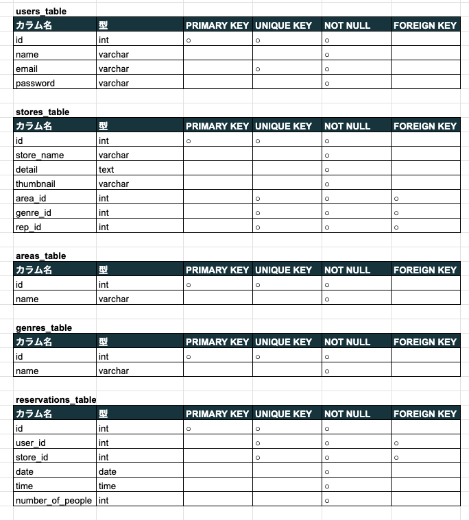

# Rese(リーズ)
ある企業のグループ会社の飲食店予約サービス
会員登録後、飲食店一覧の閲覧、お気に入り追加/削除、飲食店の予約/削除をすることができる。

## 作成した目的
外部の飲食店予約サービスは手数料を取られるので自社で予約サービスを持ちたい。

## アプリケーションのU R L

## 他のリポジトリ
https://github.com/hamakei0089/advanced-case.git

## 機能一覧
会員登録
ログイン機能
ユーザー情報取得
ユーザー飲食店お気に入り一覧取得
ユーザー飲食店予約情報取得
飲食店一覧取得
飲食店詳細取得
飲食店お気に入り追加
飲食店お気に入り削除
飲食店予約情報追加
飲食店情報削除
飲食店エリア/ジャンル/店名検索機能

## 使用技術（実行環境）
PHP 8.3.0
Laravel Framework 8.83.27
MySQL8.0.26

## テーブル設計

## ER図

# 環境構築

Dockerビルド
1. git clone git@github.com:hamakei0089/advanced-case.git
2. DckerDesktopを立ち上げる
3.docker-compose up -d –build

Laravel環境構築
1.docker-compose exec php bash
2.composer install
3.「.env.example」ファイルを「.env」ファイルに命名を変更
4. .envに以下の環境変数を追加

DB_CONNECTION=mysql
DB_HOST=mysql
DB_PORT=3306
DB_DATABASE=laravel_db
DB_USERNAME=laravel_user
DB_PASSWORD=laravel_pass

5. アプリケーションキーの作成
php artisan key:generate

6. マイグレーションの実行
php artisan migrate

7. ダミーデータのシーディング
開発環境で使用するための店舗データをデータベースに投入
php artisan db:seed --class=StoresTableSeeder

# advanced-case
# advanced-case
